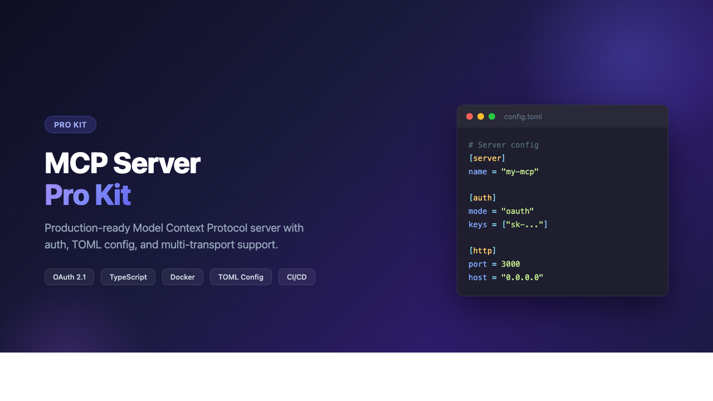

# MCP Server Boilerplate

<p align="center">
  
</p>

<p align="center">
  <a href="https://github.com/jeandbonicel/mcp-server-boilerplate/actions/workflows/ci.yml"></a>
  <a href="https://www.npmjs.com/package/mcp-server-boilerplate"></a>
</p>

Production-ready [Model Context Protocol](https://modelcontextprotocol.io/) server boilerplate with TypeScript, authentication, and multiple transports.


## Features

- **Interactive CLI** — `npx mcp-server-boilerplate init` to scaffold a new project in seconds
- **Two transports** — stdio (local) and Streamable HTTP (remote)
- **Authentication** — API key, JWT, and OAuth 2.1 with pluggable providers
- **TOML configuration** — human-readable `config.toml` with env var overrides
- **5 example tools** — calculator, echo, fetch-api, file-ops, in-memory database
- **3 example resources** — server config, dynamic key-value store, user directory
- **2 example prompts** — code review, summarization
- **Full test suite** — Vitest with in-memory MCP client/server
- **Docker ready** — multi-stage Dockerfile + docker-compose
- **CI/CD** — GitHub Actions with lint, test, build, and npm publish

## Tech Stack

- Node.js 24 LTS / TypeScript 6
- `@modelcontextprotocol/sdk` v1.29+
- Express 5 / Zod / pino / jose / smol-toml

## Quick Start

### Create a new project (recommended)

```bash
npx mcp-server-boilerplate init my-server
```

The interactive CLI will ask you to pick:
- Transport mode (stdio, HTTP, or both)
- Authentication (none, API key, or OAuth 2.1)
- Whether to include example tools/resources/prompts
- Whether to install dependencies

### Or clone the boilerplate directly

```bash
git clone https://github.com/jeandbonicel/mcp-server-boilerplate.git
cd mcp-server-boilerplate
npm install

# Run in development (stdio)
npm run dev:stdio

# Run in development (HTTP)
npm run dev:http

# Build for production
npm run build

# Run tests
npm test
```

## Usage with Claude Desktop

Add to your Claude Desktop configuration (`~/Library/Application Support/Claude/claude_desktop_config.json`):

```json
{
  "mcpServers": {
    "my-server": {
      "command": "node",
      "args": ["/path/to/mcp-server-boilerplate/dist/transports/stdio.js"]
    }
  }
}
```

## Usage as Remote Server

```bash
# Start with no auth (development)
npm run start:http

# Start with API key auth
MCP_AUTH_MODE=api-key MCP_API_KEYS=my-secret-key npm run start:http

# Start with OAuth 2.1 (demo provider)
MCP_AUTH_MODE=oauth npm run start:http
```

Then connect from any MCP client to `http://localhost:3000/mcp`.

## Configuration

Configuration uses **TOML** (`config.toml`) with environment variable overrides. Edit `config.toml` directly for most settings. Env vars take precedence when set.

### config.toml

```toml
[server]
name = "mcp-server"
version = "1.0.0"

[http]
port = 3000
host = "127.0.0.1"

[logging]
level = "info"  # fatal | error | warn | info | debug | trace

[auth]
mode = "none"   # "none" | "api-key" | "oauth"
# keys = ["my-secret-key-1", "my-secret-key-2"]

# [auth.jwt]
# issuer = "https://auth.example.com"
# audience = "mcp-server"
# secret = "your-shared-secret"
# jwks_uri = "https://auth.example.com/.well-known/jwks.json"

# [auth.oauth]
# issuer_url = "https://auth.example.com"
```

### Environment Variable Overrides

Env vars override TOML values when set. Useful for Docker, CI, or secrets.

| Variable | TOML key | Default | Description |
|---|---|---|---|
| `MCP_SERVER_NAME` | `server.name` | `mcp-server` | Server name |
| `MCP_SERVER_VERSION` | `server.version` | `1.0.0` | Server version |
| `MCP_HTTP_PORT` | `http.port` | `3000` | HTTP port |
| `MCP_HTTP_HOST` | `http.host` | `127.0.0.1` | HTTP bind host |
| `LOG_LEVEL` | `logging.level` | `info` | Log level |
| `MCP_AUTH_MODE` | `auth.mode` | `none` | Auth mode |
| `MCP_API_KEYS` | `auth.keys` | — | Comma-separated API keys |
| `MCP_JWT_ISSUER` | `auth.jwt.issuer` | — | JWT issuer |
| `MCP_JWT_AUDIENCE` | `auth.jwt.audience` | — | JWT audience |
| `MCP_JWT_SECRET` | `auth.jwt.secret` | — | JWT shared secret |
| `MCP_JWKS_URI` | `auth.jwt.jwks_uri` | — | JWKS endpoint URL |
| `MCP_OAUTH_ISSUER_URL` | `auth.oauth.issuer_url` | — | OAuth server URL |
| `MCP_CONFIG_PATH` | — | `./config.toml` | Custom path to TOML config |

## Authentication

### No Auth (default)
Best for local development with stdio transport. No configuration needed.

### API Key
Static bearer tokens. In `config.toml`:
```toml
[auth]
mode = "api-key"
keys = ["my-secret-key-1", "my-secret-key-2"]
```
Or via env: `MCP_AUTH_MODE=api-key MCP_API_KEYS=key1,key2`. Clients send `Authorization: Bearer key1` with every request.

### OAuth 2.1
Full OAuth flow with browser-based login. Set `auth.mode = "oauth"` in `config.toml` or `MCP_AUTH_MODE=oauth`. The boilerplate includes a demo in-memory OAuth provider that auto-approves all requests.

**For production**, replace `DemoOAuthProvider` in `src/auth/oauth-provider.ts` with your real identity provider, or use `JwtVerifier` to validate tokens from an external OAuth server (Auth0, Keycloak, etc.):

```typescript
// In src/transports/http.ts, replace the oauth block:
const verifier = new JwtVerifier({
  jwksUri: "https://your-auth-server.com/.well-known/jwks.json",
  issuer: "https://your-auth-server.com",
  audience: "your-mcp-server",
});
authMiddleware = requireBearerAuth({ verifier });
```

### Adding Custom Auth

1. Create a new file in `src/auth/` implementing `OAuthTokenVerifier`:
   ```typescript
   import type { OAuthTokenVerifier } from "@modelcontextprotocol/sdk/server/auth/provider.js";
   import type { AuthInfo } from "@modelcontextprotocol/sdk/server/auth/types.js";

   export class MyVerifier implements OAuthTokenVerifier {
     async verifyAccessToken(token: string): Promise<AuthInfo> {
       // Your verification logic here
       return { token, clientId: "...", scopes: ["..."] };
     }
   }
   ```
2. Add your auth mode to the config enum in `src/config.ts`
3. Wire it in `src/transports/http.ts`

## Adding Your Own Tools

Each tool is a module that exports a `register(server)` function:

```typescript
// src/tools/my-tool.ts
import type { McpServer } from "@modelcontextprotocol/sdk/server/mcp.js";
import { z } from "zod";

export function register(server: McpServer): void {
  server.registerTool("my-tool", {
    title: "My Tool",
    description: "Does something useful",
    inputSchema: {
      input: z.string().describe("The input"),
    },
  }, async ({ input }) => ({
    content: [{ type: "text", text: `Result: ${input}` }],
  }));
}
```

Then register it in `src/tools/index.ts`:

```typescript
import * as myTool from "./my-tool.js";

export function registerAll(server: McpServer): void {
  // ...existing tools...
  myTool.register(server);
}
```

## Project Structure

```
config.toml                — TOML configuration (human-readable)
src/
  cli.ts                 — Interactive project scaffolder
  config.ts              — TOML + env loader, Zod-validated
  logger.ts              — pino structured logging
  server.ts              — McpServer factory + registration
  transports/
    stdio.ts             — CLI entry point (bin)
    http.ts              — Express + Streamable HTTP + auth
  auth/
    api-key-verifier.ts  — Bearer token verification
    jwt-verifier.ts      — JWT/JWKS verification
    oauth-provider.ts    — Demo OAuth 2.1 server
  tools/                 — Example tools (echo, calculator, etc.)
  resources/             — Example resources (config, items, users)
  prompts/               — Example prompts (code-review, summarize)
tests/                   — Vitest test suite
```

## Docker

```bash
# Build and run
docker compose up --build

# Or manually
docker build -t mcp-server .
docker run -p 3000:3000 --env-file .env mcp-server
```

## Scripts

| Script | Description |
|---|---|
| `npm run dev:stdio` | Development with stdio (tsx) |
| `npm run dev:http` | Development with HTTP (tsx) |
| `npm run build` | Compile TypeScript |
| `npm run start:stdio` | Production stdio |
| `npm run start:http` | Production HTTP |
| `npm test` | Run tests |
| `npm run lint` | Lint with ESLint |
| `npm run format` | Format with Prettier |
| `npm run typecheck` | Type check without emitting |

